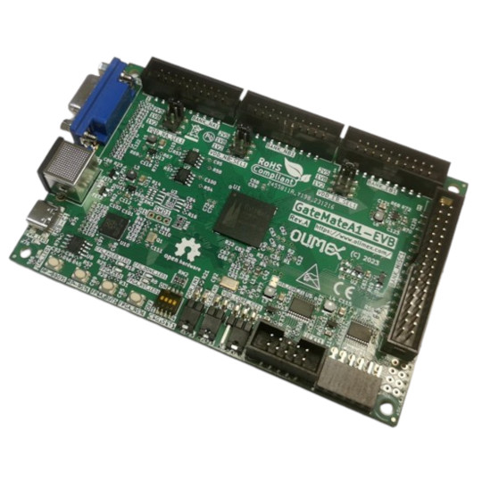

# GateMateA1-EVB
Development board for GateMateA1 CCGM1A1 FPGA from Cologne Chip with PS2 VGA 64Mbit RAM RP2040

https://www.olimex.com/Products/FPGA/GateMate/GateMateA1-EVB/open-source-hardware

Features:

* CCGM1A1 FPGA with 20480 logic cells
* PSRAM 64Mbit
* RP2040 processor for prograaming and debugging
* 2MB configuration Flash
* 4 buttons
* USB-C for power supply and programming
* PS2 connector
* VGA connector
* 4 Banks with signals with selectable levels 1.2V 1.8V 2.5V
* PMOD with level shifters
* UEXT with level shifters
* Power LED
* User LED
* 4 sections configuration slide switch
* Dimensions: 120 x 80 mm

## Licenses

* Hardware is released under CERN Open Hardware Licence Version 2 - Strongly Reciprocal, all silkscreen credits to Olimex should remain;
* Software is released under GPL3 Licensee
* Documentation is released under CC BY-SA 3.0